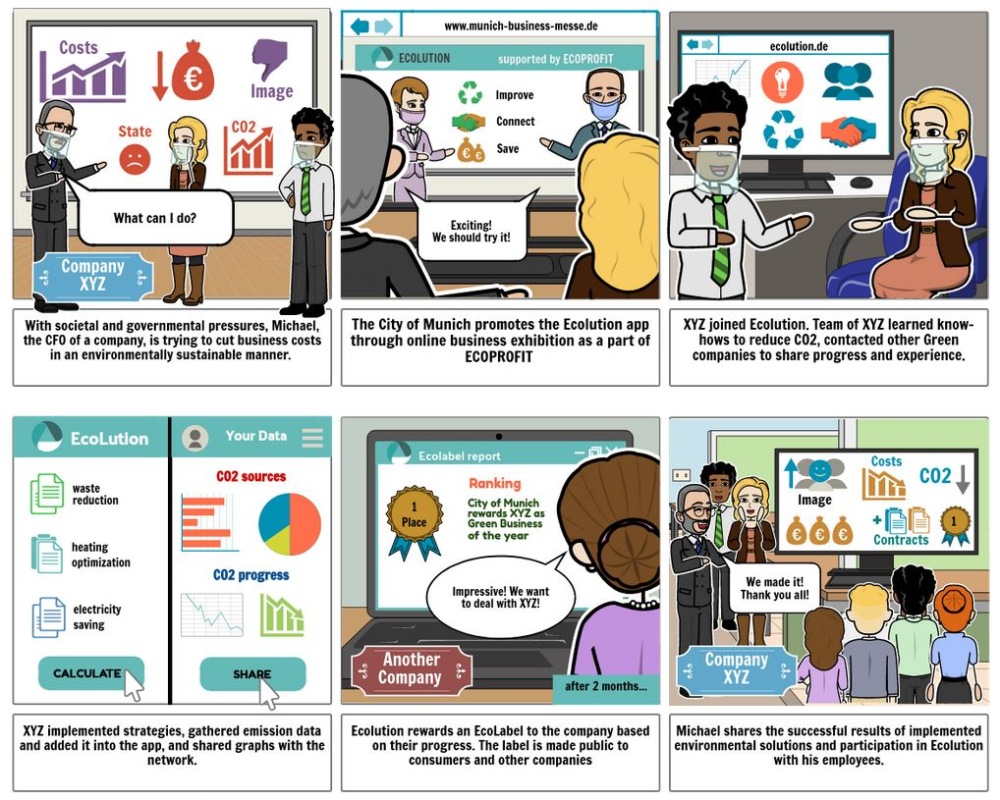

  

# Ecolution

Our team created Ecolution - an online platform that works with ECOPROFIT.\
Ecolution is intended to popularize the idea of being an ecologically responsible business. \
We aim to motivate, inspire, and connect the companies that want to reduce CO2. Ecolution helps the ECOPROFIT program to support existing members, and engage new businesses. \
Every company gets access to a personal profile as well as graphs for visualizing their CO2 data. \
They can collaborates with other companies, get advices and individual measures from ECOPROFIT program. \
Based on their progress, businesses will be awarded an ecolution label to promote more consumer support for environmentally responsible businesses.

---

# Problem Statement
The problem that we tried to face is the fact that the City of Munich set the goal of reaching climate neutrality in 2035. \
Reaching that goal isn't an easy challange expecially during time of crisis like the corona one that we are facing right now. \
Fight Climate change and motivate company to climate protection is what we want to achive.

# Solution
We developed a platform called Ecolution that has the goal of motivate people to reduce their CO2 emmission. \
In order to do that Ecolution wants to provide a stronger network of companies for information sharing through our network. \
Ecolution also provide an EcoLabel system to boost companies' social image, in order to motivate the companies even more. \
Ecolution provide easier carbon emissions tracking, and some easy user-friendly graphs that helps you visualize and keep tracking of your emission.\

# Core Features
## Visualization

Ecolution provides user-friendly graphs that are available through the dashboard. The inputted carbon data from the companies are used to generate user-friendly graphs to motivate companies to continue on their journey to carbon neutrality.

## Visibility

The EcoLabel is assigned to companies based on their progress to carbon neutrality. There are four tiers: 25%, 50%, 75% and 100% to carbon neutrality. This is available to the users as well as the public. In Sprint 2, more EcoLabels were added along with information on what each Ecolabel stands for. This information is public available and can be accessed through the menu option under About. There are currently three categories of EcoLabels.

% to Carbon Neutrality     |  Ecolution Leader             | Registered Participants        | 
:-------------------------:|:-----------------------------:|:------------------------------:|
 |  | 

## Networking

The easy networking capabilities strengthens collaboration between allow participating companies to share information on what climate conscious strategies that they have implemented and message representatives from other entities. \
Companies can input articles through the News Feed tab simply by typing up their topic and pressing upload. The generated articles and additional functions are shown in the next image.\
Each article displays the author of the company and the topic. \
They have the option to direct message the author of the article by pressing the Open Chat button (circled) on the bottom. Pressing the button will generate a chat popup (arrow). The messages to and from other companies through the Newsfeed tab can also be accessed on the message tab (arrow). Companies can also like the post by pressing the heart and see added comments.

## Participants

The Participant's List can be accessed on the header of the home page. This page shows all participating entities to the public and the users. It includes the participating business' company name, industry, assigned EcoLabels, time registered to Ecolution, and the total amount of CO2 reduce. The publicization of the EcoLabel is meant to help boost businesses' image as green business and increase consumer support for environmentally responsible entities.\
The Company's page button leads you the company description. \
This is the public view of the participants page.\
The new map feature and other information are available.\
The also is a button to directely open a chat and a butto for the bookmark function, but this options are only available for the sig-in user.

---
# Process
- **Research:** Research: To understand the scope of our challenge, we research existing measures for the current problem, ecological data, and verified statistics relevant to the problem. This narrowed our path to finding a viable solution for the City of Munich. More research was indulged in about Eco-Profit in order to utilize its full potential as well. 
     >  _**More details in [Research](https://github.com/gxc-international-innovation-challenge/gxc-team-13/wiki/Research) and [Interview](https://github.com/gxc-international-innovation-challenge/gxc-team-13/wiki/Interviews).**_
- **Ideation:**  To synthesize our research, our team created an [Empathy Map]() to set our core values clear among the team members. Using the empathy map, we brainstormed ideas and voted for the idea we wanted. A draft storyboard was created to display our solution idea before it was further developed with the help of feedback. Then a press release and a list of Frequently Asked Questions (FAQs) were created to help the team think about what needs to be achieved with our prototype. 
     > _**More details in [Storyboard], [Press Release], [Stakeholder FAQs], [Customer FAQ]
- **Prototype:** 
     >  _**For instructions on how to use the Prototype, click [here](https://github.com/gxc-international-innovation-challenge/gxc-team-13/wiki/Prototype).**_

---
### GitHub Pages
Check out our [Github Pages](https://gxc-international-innovation-challenge.github.io/gxc-team-13/).

### Wiki Navigation
* [Home](https://github.com/gxc-international-innovation-challenge/gxc-team-13/wiki)
* [Team Canvas](https://github.com/gxc-international-innovation-challenge/gxc-team-13/wiki/Team-Canvas)
* **Background**
  * [Problem Statement](https://github.com/gxc-international-innovation-challenge/gxc-team-13/wiki/Problem-Statement)
  * [Research](https://github.com/gxc-international-innovation-challenge/gxc-team-13/wiki/Research)
  * [Interviews](https://github.com/gxc-international-innovation-challenge/gxc-team-13/wiki/Interviews)
* [Ideation](https://github.com/gxc-international-innovation-challenge/gxc-team-13/wiki/Ideation)
  * [Empathy Map](https://github.com/gxc-international-innovation-challenge/gxc-team-13/wiki/Empathy-Map)
  * [Storyboard](https://github.com/gxc-international-innovation-challenge/gxc-team-13/wiki/Storyboard)
  * [Press Release](https://github.com/gxc-international-innovation-challenge/gxc-team-13/wiki/Press-Release)
  * FAQs 
	* [Stakeholder FAQs](https://github.com/gxc-international-innovation-challenge/gxc-team-13/wiki/Stakeholder-FAQs)
	* [Customers FAQs](https://github.com/gxc-international-innovation-challenge/gxc-team-13/wiki/Customers-FAQs)
* [Prototype](https://github.com/gxc-international-innovation-challenge/gxc-team-13/wiki/Prototype)
  * [Version 1 Prototype](https://github.com/gxc-international-innovation-challenge/gxc-team-13/wiki/Version-1-Prototype)
  * [Version 2 Prototype](https://github.com/gxc-international-innovation-challenge/gxc-team-13/wiki/Version-2-Prototype)
* [Business Model Canvas](https://github.com/gxc-international-innovation-challenge/gxc-team-13/wiki/Business-Model-Canvas)
* [[Final Presentation]](https://github.com/gxc-international-innovation-challenge/gxc-team-13/wiki/Final-Presentation)

